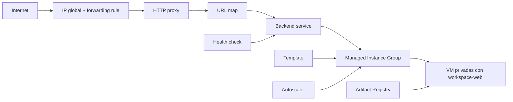

# GCP Infra Foundation

Infraestructura como código con Terraform para ejecutar una carga web contenerizada en Google Cloud.

El diseño utiliza máquinas virtuales privadas y reemplazables dentro de un Managed Instance Group (MIG), detrás de un balanceador de carga externo y con capacidad de autoescalado.

## Arquitectura

El balanceador será el único punto de entrada público. Las VM compartirán una plantilla y podrán reemplazarse automáticamente: se administran como ganado, no como mascotas.

## Estado del proyecto

Los checks representan funcionalidades implementadas en el repositorio, no necesariamente servicios en ejecución. En GCP ya están aplicados la red, el firewall, Artifact Registry, la identidad de las VM, la Instance Template y el MIG, configurado con cero instancias. La imagen `workspace-web:0.2` está publicada en Artifact Registry.

- [x] Foundation modular con VPC, subredes y firewall.
- [x] Primera implementación con VM individuales, públicas y privadas.
- [x] Retirada del modelo de VM individuales para adoptar infraestructura inmutable.
- [x] Repositorio privado de imágenes en Artifact Registry.
- [x] Identidad dedicada con permisos mínimos de lectura.
- [x] Política de firewall versionada para IAP y el balanceador.
- [x] Instance Template basada en la imagen publicada.
- [x] Managed Instance Group configurado para crear VM privadas y reemplazables.
- [x] Health check HTTP definido para la web.
- [x] Backend service conectado al MIG.
- [x] Mapa de URL y proxy HTTP del balanceador.
- [ ] Frontend público con IP global y forwarding rule.
- [ ] Política de autoescalado.
- [ ] Despliegue y prueba del recorrido completo.

## Componentes

| Componente | Responsabilidad |
| --- | --- |
| `modules/project-services` | Habilita las APIs necesarias. |
| `modules/vpc` | Crea la red VPC custom. |
| `modules/subnets` | Gestiona las subredes. |
| `modules/firewall-rules` | Crea reglas de firewall reutilizables. |
| `firewall.tf` | Define la política de acceso del proyecto. |
| `modules/artifact-registry` | Gestiona el repositorio de imágenes Docker. |
| `modules/vm-runtime-identity` | Crea la identidad utilizada por las VM. |
| `modules/instance-template` | Define la plantilla inmutable de las VM web. |
| `modules/managed-instance-group` | Mantiene el grupo de VM reemplazables. |
| `health-check.tf` | Comprueba si la aplicación web responde por HTTP. |
| `backend-service.tf` | Conecta el balanceador con el MIG y utiliza el health check. |
| `url-map.tf` | Envía el tráfico al backend service web. |
| `http-proxy.tf` | Conecta el frontend HTTP con el mapa de URL. |

## Seguridad

- Las VM creadas por el MIG no reciben IP pública.
- SSH está limitado a Google IAP.
- El puerto `80` solo acepta tráfico del balanceador y sus health checks.
- La identidad de las VM solo puede leer imágenes de `workspace-images`.
- La política de firewall está versionada en `firewall.tf`.
